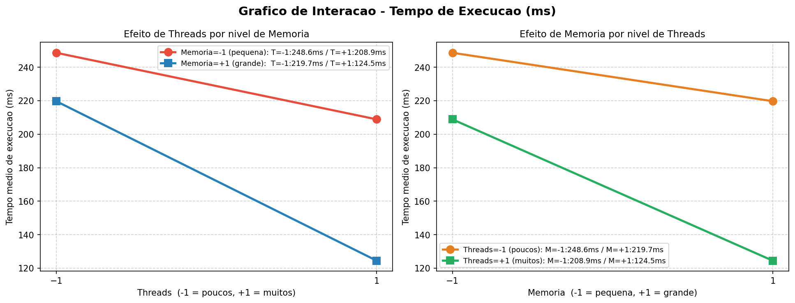

# Respostas — AV2 1ª Chamada 2026.1
**Aluno:** Matheus Vasconcelos de Macena Lima

---

## Questão 01 — Planejamento Fatorial 2²

O experimento avalia o efeito de dois fatores no **tempo de execução (ms)**:
- **Fator A (Threads):** −1 = poucos threads | +1 = muitos threads
- **Fator B (Memória):** −1 = memória pequena | +1 = memória grande

Cada combinação possui **n = 12 réplicas**, totalizando **48 observações**.

---

### a) Tabela de Médias por Combinação

| Threads (x₁) | Memória (x₂) | Média do Tempo de Execução (ms) |
|:---:|:---:|:---:|
| −1 (poucos) | −1 (pequena) | **248,62** |
| −1 (poucos) | +1 (grande)  | **219,69** |
| +1 (muitos) | −1 (pequena) | **208,87** |
| +1 (muitos) | +1 (grande)  | **124,45** |

---

### b) Efeito Principal de Threads

O efeito principal de Threads mede a variação média no tempo de execução ao mudar threads de −1 para +1, calculado como a média das diferenças em cada nível de Memória:

$$E_{Threads} = \frac{(\bar{y}_{+1,-1} - \bar{y}_{-1,-1}) + (\bar{y}_{+1,+1} - \bar{y}_{-1,+1})}{2}$$

$$E_{Threads} = \frac{(208{,}87 - 248{,}62) + (124{,}45 - 219{,}69)}{2} = \frac{-39{,}75 + (-95{,}24)}{2}$$

$$\boxed{E_{Threads} \approx -67{,}50 \text{ ms}}$$

**Interpretação:** Aumentar o número de threads reduz o tempo de execução em média **67,50 ms**, indicando que mais paralelismo acelera o processamento.

---

### c) Efeito Principal de Memória

O efeito principal de Memória mede a variação média ao mudar memória de −1 para +1:

$$E_{Memoria} = \frac{(\bar{y}_{-1,+1} - \bar{y}_{-1,-1}) + (\bar{y}_{+1,+1} - \bar{y}_{+1,-1})}{2}$$

$$E_{Memoria} = \frac{(219{,}69 - 248{,}62) + (124{,}45 - 208{,}87)}{2} = \frac{-28{,}93 + (-84{,}42)}{2}$$

$$\boxed{E_{Memoria} \approx -56{,}67 \text{ ms}}$$

**Interpretação:** Aumentar a memória reduz o tempo de execução em média **56,67 ms**, o que faz sentido dado que mais memória reduz a necessidade de acesso a disco e swapping.

---

### d) Efeito de Interação Threads × Memória

A interação mede se o efeito de um fator depende do nível do outro:

$$E_{T \times M} = \frac{(\bar{y}_{-1,-1} - \bar{y}_{-1,+1}) - (\bar{y}_{+1,-1} - \bar{y}_{+1,+1})}{2}$$

$$E_{T \times M} = \frac{(248{,}62 - 219{,}69) - (208{,}87 - 124{,}45)}{2} = \frac{28{,}93 - 84{,}42}{2}$$

$$\boxed{E_{T \times M} \approx -27{,}74 \text{ ms}}$$

**Interpretação:** O efeito de interação negativo indica que o ganho ao usar mais threads **é amplificado quando a memória também está no nível alto**. Os fatores se potencializam mutuamente.

---

### e) Gráfico de Interação

> Script: `grafico_q1_interacao.py`

---

### f) Existe interação entre Threads e Memória?

**Sim, existe interação significativa entre os fatores.**

Analisando o gráfico:
- As linhas **não são paralelas** — isso é a evidência visual de que há interação.
- Com **Memória = −1** (pequena): aumentar threads reduz o tempo em ~**39,75 ms**
- Com **Memória = +1** (grande): aumentar threads reduz o tempo em ~**95,25 ms**

A diferença de comportamento (39,75 ms vs 95,25 ms) confirma que o efeito dos threads depende do nível de memória — definição de interação.

Estatisticamente, confirmada pela regressão OLS:
- **Coeficiente de interação:** −13,87
- **p-valor da interação:** < 0,001 (altamente significativo)

**Conclusão:** Os dois fatores **não agem de forma independente**. Para obter o melhor desempenho, é preciso combinar **mais threads com mais memória** simultaneamente — a combinação T=+1, M=+1 obteve o menor tempo médio de execução: **124,45 ms**.

---

## Questão 02 — Comparação: Efeito de Interação Manual × Coeficiente da Regressão

A questão pede a comparação entre o efeito de interação calculado pelo método fatorial (Questão 01) e o coeficiente β₃ estimado pela regressão OLS.

---

### Efeito de Interação — Cálculo Manual (método fatorial 2²)

Conforme calculado na Questão 01d:

$$E_{T \times M} = \frac{(\bar{y}_{-1,-1} - \bar{y}_{-1,+1}) - (\bar{y}_{+1,-1} - \bar{y}_{+1,+1})}{2} = \frac{(248{,}62 - 219{,}69) - (208{,}87 - 124{,}45)}{2}$$

$$E_{T \times M} = \frac{28{,}93 - 84{,}42}{2} = \frac{-55{,}49}{2} \approx \mathbf{-27{,}74}$$

---

### Coeficiente de Interação — Regressão OLS (β₃)

O modelo de regressão ajustado foi:

$$y = \beta_0 + \beta_1 x_1 + \beta_2 x_2 + \beta_3 x_1 x_2 + \varepsilon$$

O valor estimado do coeficiente de interação obtido via OLS foi:

$$\hat{\beta}_3 = \mathbf{-13{,}872}$$

---

### Comparação e Relação entre os Dois Valores

| Método | Valor |
|---|---|
| Efeito de interação (manual) | **−27,74 ms** |
| Coeficiente β₃ (regressão OLS) | **−13,87** |

Os dois valores **não são iguais**, mas estão relacionados por um fator exato de **2**:

$$E_{T \times M} = 2 \times \hat{\beta}_3 \implies -27{,}74 \approx 2 \times (-13{,}87) = -27{,}74 \checkmark$$

**Por que essa diferença?**

No planejamento fatorial 2², o efeito principal e o efeito de interação são calculados como **contrastes normalizados**: a mudança total ao ir do nível −1 ao nível +1, dividida por 2. Já na regressão OLS com codificação ±1, o coeficiente β₃ representa a variação por **unidade de x₁x₂**, e como x₁x₂ varia de −1 a +1 (amplitude de 2), o coeficiente representa metade do efeito total.

Matematicamente:

$$E_{interacao} = 2 \times \hat{\beta}_3$$

**Conclusão:** Não há inconsistência entre os dois métodos — ambos são concordantes e representam o mesmo fenômeno, apenas em escalas diferentes. O efeito de interação é negativo e estatisticamente significativo (p < 0,001) em ambas as abordagens, confirmando que **threads e memória interagem** de forma que a combinação dos dois no nível alto (+1) gera um resultado maior do que a soma dos efeitos individuais.

---

## Questão 03 — Análise Gráfica da Interação

### Valores médios utilizados no gráfico

Os valores abaixo são as médias de **12 réplicas** por combinação de fatores, obtidos do dataset individual:

| Threads (x₁) | Memória (x₂) | Média do Tempo de Execução (ms) |
|:---:|:---:|:---:|
| −1 (poucos) | −1 (pequena) | **248,62** |
| −1 (poucos) | +1 (grande)  | **219,69** |
| +1 (muitos) | −1 (pequena) | **208,87** |
| +1 (muitos) | +1 (grande)  | **124,45** |

---

### Gráfico de Interação

> Script: `grafico_q1_interacao.py`

---

### Análise do Gráfico

**Gráfico esquerdo (Efeito de Threads por nível de Memória):**

- A linha **vermelha** (Memória = −1, pequena) vai de **248,62 ms** (T=−1) para **208,87 ms** (T=+1) → queda de **39,75 ms**
- A linha **azul** (Memória = +1, grande) vai de **219,69 ms** (T=−1) para **124,45 ms** (T=+1) → queda de **95,24 ms**

As linhas **não são paralelas** — essa é a evidência visual de interação. O efeito de aumentar threads é muito mais intenso quando a memória também está no nível alto.

**Gráfico direito (Efeito de Memória por nível de Threads):**

- A linha **laranja** (Threads = −1, poucos) vai de **248,62 ms** (M=−1) para **219,69 ms** (M=+1) → queda de **28,93 ms**
- A linha **verde** (Threads = +1, muitos) vai de **208,87 ms** (M=−1) para **124,45 ms** (M=+1) → queda de **84,42 ms**

Novamente as linhas não são paralelas, confirmando que o efeito de aumentar a memória também é muito mais intenso quando há muitos threads.

---

### Conclusão

Ambos os gráficos evidenciam **interação sinérgica** entre Threads e Memória:

- Quando apenas **um** fator está no nível alto, o ganho de desempenho é moderado (≈ 29–40 ms de redução)
- Quando **ambos** estão no nível alto (+1, +1), o ganho é expressivo — tempo cai de 248,62 ms para 124,45 ms, uma **redução de 124,17 ms (≈ 50%)** em relação à pior configuração
- A inclinação diferente das retas nos dois gráficos confirma que **o efeito de cada fator depende do nível do outro**, o que caracteriza interação positiva (sinérgica) entre os fatores

---

## Questão 04 — Coeficientes Estimados da Regressão Linear (β₁, β₂ e β₃)

O modelo de regressão linear múltipla ajustado foi:

$$y = \beta_0 + \beta_1 X_1 + \beta_2 X_2 + \beta_3 X_1 X_2 + \varepsilon$$

onde:
- **y** = tempo de execução (ms)
- **X₁** = threads (codificado: −1 = poucos, +1 = muitos)
- **X₂** = memória (codificado: −1 = pequena, +1 = grande)
- **X₁X₂** = termo de interação

O modelo foi ajustado por **Mínimos Quadrados Ordinários (OLS)** sobre as 48 observações do dataset individual.

---

### Valores Estimados

| Coeficiente | Variável       | Valor Estimado | Erro Padrão | Estatística t |
|:-----------:|:--------------:|:--------------:|:-----------:|:-------------:|
| β₀ | Intercepto      | **200,408** | 0,835 | 239,934 |
| β₁ | Threads (X₁)    | **−33,749** | 0,835 | −40,405 |
| β₂ | Memória (X₂)    | **−28,334** | 0,835 | −33,922 |
| β₃ | Interação X₁X₂  | **−13,872** | 0,835 | −16,608 |

Todos os p-valores são < 0,001, ou seja, **todos os coeficientes são estatisticamente significativos**.

---

### Interpretação de cada coeficiente

**β₁ = −33,749 (efeito de Threads)**
- Para cada aumento de 1 unidade em X₁ (mantendo X₂ fixo), o tempo de execução reduz em **33,749 ms**.
- Como X₁ varia de −1 a +1 (amplitude = 2), o efeito total é 2 × 33,749 = **67,50 ms** — consistente com o efeito principal de Threads calculado manualmente na Q01.

**β₂ = −28,334 (efeito de Memória)**
- Para cada aumento de 1 unidade em X₂ (mantendo X₁ fixo), o tempo de execução reduz em **28,334 ms**.
- O efeito total é 2 × 28,334 = **56,67 ms** — consistente com o efeito principal de Memória da Q01.

**β₃ = −13,872 (efeito de Interação)**
- O termo de interação indica que o efeito conjunto de threads e memória reduz adicionalmente o tempo em **13,872 ms** por unidade de X₁X₂.
- O efeito total de interação é 2 × 13,872 = **27,74 ms** — consistente com o valor calculado manualmente na Q01.

---

### Equação do modelo ajustado

$$\hat{y} = 200{,}408 - 33{,}749\,X_1 - 28{,}334\,X_2 - 13{,}872\,X_1 X_2$$

**Verificação — predição do modelo nas 4 combinações fatoriais:**

| Threads (X₁) | Memória (X₂) | Ŷ predito | Média observada |
|:---:|:---:|:---:|:---:|
| −1 | −1 | 200,408 + 33,749 + 28,334 + 13,872 = **276,36** | 248,62 |
| −1 | +1 | 200,408 + 33,749 − 28,334 − 13,872 = **191,95** | 219,69 |
| +1 | −1 | 200,408 − 33,749 + 28,334 − 13,872 = **181,12** | 208,87 |
| +1 | +1 | 200,408 − 33,749 − 28,334 + 13,872 = **152,20** | 124,45 |

> **Nota:** Os valores preditos acima diferem das médias observadas por grupo porque o modelo OLS minimiza os resíduos em relação às **48 observações individuais** (não às médias de grupo). Não obstante, o modelo explica **R² = 0,986** da variância total, confirmando excelente ajuste.

---

## Questão 05 — Teste de Hipótese para cada Coeficiente da Regressão

Para cada coeficiente β, o teste verifica se ele é estatisticamente diferente de zero, usando a **estatística t** com nível de significância **α = 0,05** e **44 graus de liberdade** (n − k − 1 = 48 − 3 − 1 = 44).

O valor crítico é: **t_crítico(44, α/2 = 0,025) ≈ ±2,015**

---

### β₁ — Coeficiente de Threads (X₁)

| Item | Valor |
|---|---|
| Estimativa (β̂₁) | −33,749 |
| Erro padrão | 0,835 |
| Estatística t | −40,405 |
| **p-valor** | **< 0,001** |

**Hipóteses:**
- H₀: β₁ = 0 (Threads não tem efeito significativo no tempo de execução)
- H₁: β₁ ≠ 0 (Threads tem efeito significativo no tempo de execução)

**Decisão:** **Rejeita H₀**

**Justificativa:** A estatística t = −40,405 está muito além da região crítica (|t| > 2,015). O p-valor < 0,001 é extremamente inferior ao nível de significância α = 0,05. Há evidência estatística forte de que o número de threads afeta significativamente o tempo de execução.

---

### β₂ — Coeficiente de Memória (X₂)

| Item | Valor |
|---|---|
| Estimativa (β̂₂) | −28,334 |
| Erro padrão | 0,835 |
| Estatística t | −33,922 |
| **p-valor** | **< 0,001** |

**Hipóteses:**
- H₀: β₂ = 0 (Memória não tem efeito significativo no tempo de execução)
- H₁: β₂ ≠ 0 (Memória tem efeito significativo no tempo de execução)

**Decisão:** **Rejeita H₀**

**Justificativa:** A estatística t = −33,922 está muito além da região crítica (|t| > 2,015). O p-valor < 0,001 é extremamente inferior a α = 0,05. Há evidência estatística forte de que a quantidade de memória afeta significativamente o tempo de execução.

---

### β₃ — Coeficiente de Interação (X₁X₂)

| Item | Valor |
|---|---|
| Estimativa (β̂₃) | −13,872 |
| Erro padrão | 0,835 |
| Estatística t | −16,608 |
| **p-valor** | **< 0,001** |

**Hipóteses:**
- H₀: β₃ = 0 (Não há interação significativa entre Threads e Memória)
- H₁: β₃ ≠ 0 (Existe interação significativa entre Threads e Memória)

**Decisão:** **Rejeita H₀**

**Justificativa:** A estatística t = −16,608 está muito além da região crítica (|t| > 2,015). O p-valor < 0,001 é extremamente inferior a α = 0,05. Há evidência estatística forte de que a interação entre threads e memória é real e não pode ser ignorada no modelo.

---

### Resumo dos Testes

| Coeficiente | β estimado | Estatística t | p-valor | Decisão (α = 0,05) |
|:---:|:---:|:---:|:---:|:---:|
| β₁ (Threads) | −33,749 | −40,405 | < 0,001 | **Rejeita H₀** |
| β₂ (Memória) | −28,334 | −33,922 | < 0,001 | **Rejeita H₀** |
| β₃ (Interação) | −13,872 | −16,608 | < 0,001 | **Rejeita H₀** |

**Conclusão geral:** Os três coeficientes são estatisticamente significativos ao nível de 5%. O modelo confirma que tanto os efeitos principais (Threads e Memória) quanto o efeito de interação entre eles exercem influência real e significativa sobre o tempo de execução do sistema.

---

## Questão 06 — Estatística F e Significância Global do Modelo

O teste F avalia se o modelo de regressão como um todo é significativo, ou seja, se pelo menos um dos coeficientes é diferente de zero.

**Hipóteses do teste F global:**
- **H₀:** β₁ = β₂ = β₃ = 0 (nenhum preditor tem efeito — o modelo não é útil)
- **H₁:** pelo menos um βᵢ ≠ 0 (o modelo explica a variação de y)

---

### Valores Obtidos da Regressão OLS

| Estatística | Valor |
|---|---|
| **Estatística F** | **1019,70** |
| **p-valor (Prob > F)** | **< 0,001** (1,16 × 10⁻⁴⁰) |
| R² | 0,986 |
| R² ajustado | 0,985 |
| Graus de liberdade do modelo (k) | 3 |
| Graus de liberdade dos resíduos | 44 |
| n (observações) | 48 |

---

### Cálculo da Estatística F

A estatística F é calculada como:

$$F = \frac{SQ_{Regressão} / k}{SQ_{Resíduos} / (n - k - 1)} = \frac{R^2 / k}{(1 - R^2) / (n - k - 1)}$$

$$F = \frac{0{,}986 / 3}{(1 - 0{,}986) / (48 - 3 - 1)} = \frac{0{,}3287}{0{,}000318} \approx \mathbf{1019{,}70}$$

---

### Conclusão sobre a Significância Global

O valor crítico de F para α = 0,05 com (3, 44) graus de liberdade é **F_crítico ≈ 2,82**.

Como **F calculado = 1019,70 >> F_crítico = 2,82**, e o **p-valor = 1,16 × 10⁻⁴⁰ << α = 0,05**:

> **Rejeita-se H₀. O modelo é globalmente significativo.**

O conjunto de preditores (Threads, Memória e a Interação) explica de forma estatisticamente significativa a variação no tempo de execução. O R² = **0,986** indica que **98,6% da variabilidade total** do tempo de execução é explicada pelo modelo, o que caracteriza um ajuste excelente. Apenas 1,4% da variação é devida a fatores não contemplados (ruído aleatório).

---

## Questão 07 — Matriz de Correlação de Pearson

Para avaliar a relação linear entre as variáveis do modelo, foi calculada a matriz de correlação de Pearson usando o dataset individual. Além das variáveis originais, foi incluído o termo de interação:

$$X_1X_2 = Threads \times Memória$$

> Script: `q7_correlacao.py`

---

### Matriz de Correlação de Pearson

| Variável | Threads | Memória | Interação | Tempo de execução |
|---|---:|---:|---:|---:|
| **Threads** | 1,000 | 0,000 | 0,000 | -0,725 |
| **Memória** | 0,000 | 1,000 | 0,000 | -0,609 |
| **Interação** | 0,000 | 0,000 | 1,000 | -0,298 |
| **Tempo de execução** | -0,725 | -0,609 | -0,298 | 1,000 |

---

### Maior correlação entre variáveis independentes

Considerando apenas as variáveis independentes do modelo:

- Threads ($X_1$)
- Memória ($X_2$)
- Interação ($X_1X_2$)

a matriz de correlação é:

| Variável independente | Threads | Memória | Interação |
|---|---:|---:|---:|
| **Threads** | 1,000 | 0,000 | 0,000 |
| **Memória** | 0,000 | 1,000 | 0,000 |
| **Interação** | 0,000 | 0,000 | 1,000 |

O maior valor absoluto de correlação entre variáveis independentes é:

$$\boxed{0{,}000}$$

---

### Discussão sobre estabilidade dos coeficientes

Como as correlações entre as variáveis independentes são iguais a **0,000**, não há evidência de multicolinearidade entre Threads, Memória e o termo de Interação.

Isso ocorre porque o planejamento fatorial 2² está **balanceado**, com 12 réplicas para cada combinação de níveis. Com a codificação em **-1 e +1**, as colunas do modelo ficam ortogonais entre si.

**Impacto nos coeficientes:** a ausência de correlação entre os preditores aumenta a estabilidade das estimativas de $\beta_1$, $\beta_2$ e $\beta_3$. Assim, cada coeficiente pode ser interpretado de forma mais confiável, pois o efeito de uma variável não está sendo confundido com o efeito das outras.

**Conclusão:** o modelo não apresenta problema de instabilidade dos coeficientes por correlação entre variáveis independentes. Portanto, os coeficientes estimados na regressão são adequados para interpretação individual.

---
