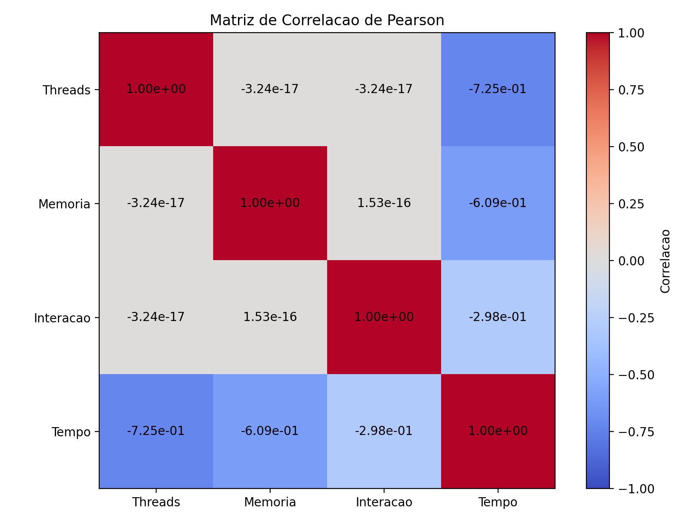
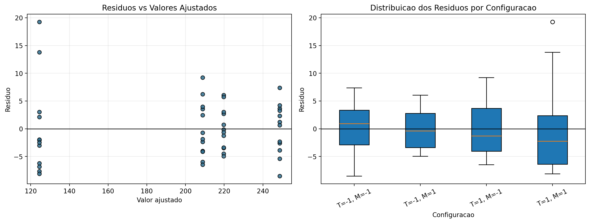

# Respostas — AV2 1ª Chamada 2026.1

**Aluno:** Matheus Vasconcelos de Macena Lima

Este relatório utiliza exclusivamente o `dataset.csv` gerado a partir do `dataset_individual.py`, conforme solicitado no enunciado. O experimento possui 48 observações, organizadas em um planejamento fatorial 2² com 12 réplicas em cada combinação de níveis.

As variáveis do experimento são:

| Variável | Descrição | Codificação |
|---|---|---|
| Threads (X₁) | quantidade de threads | -1 = poucos threads; +1 = muitos threads |
| Memória (X₂) | quantidade de memória | -1 = memória pequena; +1 = memória grande |
| Tempo de execução | variável resposta | tempo medido em milissegundos |

---

## Questão 01 — Efeitos do Planejamento Fatorial 2²

O objetivo desta questão é calcular os efeitos principais de Threads e Memória e o efeito de interação entre os dois fatores. As médias observadas no dataset individual foram:

| Threads (X₁) | Memória (X₂) | Média do tempo de execução |
|---:|---:|---:|
| -1 | -1 | 248,62 ms |
| -1 | +1 | 219,69 ms |
| +1 | -1 | 208,87 ms |
| +1 | +1 | 124,45 ms |

### Efeito principal de Threads

O efeito principal de Threads mede a variação média no tempo de execução ao mudar Threads do nível baixo (-1) para o nível alto (+1), considerando os dois níveis de Memória:

$$E_{Threads} = \frac{(208{,}87 - 248{,}62) + (124{,}45 - 219{,}69)}{2}$$

$$E_{Threads} = \frac{-39{,}75 + (-95{,}24)}{2} = -67{,}50 \text{ ms}$$

Portanto:

$$\boxed{E_{Threads} = -67{,}50 \text{ ms}}$$

O sinal negativo indica que aumentar o número de threads reduz o tempo de execução. Em média, a mudança de poucos threads para muitos threads diminuiu o tempo em aproximadamente 67,50 ms.

### Efeito principal de Memória

O efeito principal de Memória mede a variação média no tempo de execução ao mudar Memória do nível baixo (-1) para o nível alto (+1), considerando os dois níveis de Threads:

$$E_{Memoria} = \frac{(219{,}69 - 248{,}62) + (124{,}45 - 208{,}87)}{2}$$

$$E_{Memoria} = \frac{-28{,}93 + (-84{,}42)}{2} = -56{,}67 \text{ ms}$$

Portanto:

$$\boxed{E_{Memoria} = -56{,}67 \text{ ms}}$$

O sinal negativo mostra que aumentar a memória também reduz o tempo de execução. Em média, a mudança de memória pequena para memória grande reduziu o tempo em aproximadamente 56,67 ms.

### Efeito de interação Threads × Memória

O efeito de interação avalia se o efeito de um fator depende do nível do outro fator. Para este planejamento:

$$E_{T \times M} = \frac{(248{,}62 - 219{,}69) - (208{,}87 - 124{,}45)}{2}$$

$$E_{T \times M} = \frac{28{,}93 - 84{,}42}{2} = -27{,}74 \text{ ms}$$

Portanto:

$$\boxed{E_{T \times M} = -27{,}74 \text{ ms}}$$

O efeito de interação negativo indica que o ganho de desempenho é maior quando Threads e Memória são aumentados simultaneamente. A combinação (+1, +1) não apenas melhora o desempenho, mas potencializa o ganho em relação ao uso isolado de cada fator.

---

## Questão 02 — Comparação entre Interação Manual e Coeficiente da Regressão

A regressão utilizada no trabalho tem a forma:

$$y = \beta_0 + \beta_1X_1 + \beta_2X_2 + \beta_3X_1X_2 + \varepsilon$$

Na Questão 01, o efeito de interação calculado manualmente foi:

$$E_{T \times M} = -27{,}74 \text{ ms}$$

Na regressão, o coeficiente estimado para o termo de interação foi:

$$\hat{\beta}_3 = -13{,}872$$

Esses valores não são iguais numericamente porque estão em escalas diferentes. Com codificação fatorial em -1 e +1, o coeficiente da regressão representa metade do efeito fatorial:

$$E_{T \times M} = 2 \times \hat{\beta}_3$$

Substituindo o valor estimado:

$$2 \times (-13{,}872) = -27{,}744 \text{ ms}$$

Esse valor coincide com o efeito manual, considerando arredondamento:

$$\boxed{-27{,}74 \approx -27{,}74}$$

Assim, os dois métodos são consistentes. O cálculo manual e a regressão indicam a mesma conclusão: existe uma interação negativa entre Threads e Memória, ou seja, o uso conjunto de muitos threads com memória grande reduz o tempo de execução além do que seria esperado pelos efeitos principais isolados.

---

## Questão 03 — Análise Gráfica da Interação

Os valores médios utilizados no gráfico de interação foram:

| Threads (X₁) | Memória (X₂) | Média do tempo de execução |
|---:|---:|---:|
| -1 | -1 | 248,62 ms |
| -1 | +1 | 219,69 ms |
| +1 | -1 | 208,87 ms |
| +1 | +1 | 124,45 ms |

> Script: `grafico_q1_interacao.py`

No gráfico, observa-se que as linhas não são paralelas. Esse é o principal indício visual de interação: o efeito de aumentar Threads muda conforme o nível de Memória.

Quando Memória está no nível baixo (-1), aumentar Threads reduz o tempo de 248,62 ms para 208,87 ms, uma redução de 39,75 ms. Quando Memória está no nível alto (+1), aumentar Threads reduz o tempo de 219,69 ms para 124,45 ms, uma redução de 95,24 ms.

Portanto, o efeito de Threads é mais forte quando a Memória também está no nível alto. De modo equivalente, o efeito de Memória é mais forte quando Threads está no nível alto:

| Comparação | Redução observada |
|---|---:|
| Aumentar Threads com Memória = -1 | -39,75 ms |
| Aumentar Threads com Memória = +1 | -95,24 ms |
| Aumentar Memória com Threads = -1 | -28,93 ms |
| Aumentar Memória com Threads = +1 | -84,42 ms |

Essa diferença nas reduções confirma que os fatores não atuam de forma independente. O gráfico, portanto, sustenta a conclusão estatística de que existe interação entre Threads e Memória.

---

## Questão 04 — Coeficientes Estimados da Regressão Linear

Foi ajustado o modelo:

$$y = \beta_0 + \beta_1X_1 + \beta_2X_2 + \beta_3X_1X_2 + \varepsilon$$

Os coeficientes estimados pelo método dos mínimos quadrados ordinários foram:

| Coeficiente | Variável | Estimativa | Erro padrão | Estatística t |
|---:|---|---:|---:|---:|
| β₀ | Intercepto | 200,408 | 0,835 | 239,934 |
| β₁ | Threads | -33,749 | 0,835 | -40,405 |
| β₂ | Memória | -28,334 | 0,835 | -33,922 |
| β₃ | Interação Threads × Memória | -13,872 | 0,835 | -16,608 |

A equação estimada é:

$$\hat{y} = 200{,}408 - 33{,}749X_1 - 28{,}334X_2 - 13{,}872X_1X_2$$

Como o planejamento é balanceado e inclui o termo de interação, as predições do modelo coincidem com as médias por combinação:

| Threads | Memória | Predição do modelo | Média observada |
|---:|---:|---:|---:|
| -1 | -1 | 248,62 ms | 248,62 ms |
| -1 | +1 | 219,69 ms | 219,69 ms |
| +1 | -1 | 208,87 ms | 208,87 ms |
| +1 | +1 | 124,45 ms | 124,45 ms |

Interpretação dos coeficientes:

- β₁ = -33,749 indica que o aumento de uma unidade em X₁ reduz o tempo esperado em 33,749 ms, mantendo os demais termos conforme o modelo.
- β₂ = -28,334 indica que o aumento de uma unidade em X₂ reduz o tempo esperado em 28,334 ms.
- β₃ = -13,872 mostra que a combinação entre muitos threads e memória grande gera redução adicional no tempo de execução.

Como os fatores variam de -1 para +1, a variação total entre níveis corresponde ao dobro do coeficiente. Por isso, 2β₁ = -67,50 ms, 2β₂ = -56,67 ms e 2β₃ = -27,74 ms, valores compatíveis com os efeitos fatoriais calculados.

---

## Questão 05 — Teste de Hipótese para cada Coeficiente

Para cada coeficiente, foi testado se ele é estatisticamente diferente de zero. O nível de significância adotado foi α = 0,05. O modelo possui 48 observações e 3 preditores, logo os graus de liberdade residuais são:

$$gl = 48 - 3 - 1 = 44$$

O valor crítico aproximado para teste bicaudal com 44 graus de liberdade é:

$$t_{critico} \approx \pm 2{,}015$$

### Teste para β₁ — Threads

Hipóteses:

- H₀: β₁ = 0, isto é, Threads não possui efeito significativo sobre o tempo de execução.
- H₁: β₁ ≠ 0, isto é, Threads possui efeito significativo sobre o tempo de execução.

Resultados:

| Estatística | Valor |
|---|---:|
| β̂₁ | -33,749 |
| Erro padrão | 0,835 |
| t calculado | -40,405 |
| p-valor | < 0,001 |

Como |t| = 40,405 é muito maior que 2,015 e o p-valor é menor que 0,001, rejeita-se H₀. Portanto, Threads possui efeito estatisticamente significativo no tempo de execução.

### Teste para β₂ — Memória

Hipóteses:

- H₀: β₂ = 0, isto é, Memória não possui efeito significativo sobre o tempo de execução.
- H₁: β₂ ≠ 0, isto é, Memória possui efeito significativo sobre o tempo de execução.

Resultados:

| Estatística | Valor |
|---|---:|
| β̂₂ | -28,334 |
| Erro padrão | 0,835 |
| t calculado | -33,922 |
| p-valor | < 0,001 |

Como |t| = 33,922 é muito maior que 2,015 e o p-valor é menor que 0,001, rejeita-se H₀. Portanto, Memória possui efeito estatisticamente significativo no tempo de execução.

### Teste para β₃ — Interação

Hipóteses:

- H₀: β₃ = 0, isto é, não há interação significativa entre Threads e Memória.
- H₁: β₃ ≠ 0, isto é, há interação significativa entre Threads e Memória.

Resultados:

| Estatística | Valor |
|---|---:|
| β̂₃ | -13,872 |
| Erro padrão | 0,835 |
| t calculado | -16,608 |
| p-valor | < 0,001 |

Como |t| = 16,608 é muito maior que 2,015 e o p-valor é menor que 0,001, rejeita-se H₀. Portanto, existe interação estatisticamente significativa entre Threads e Memória.

### Síntese dos testes

| Coeficiente | t calculado | p-valor | Decisão |
|---:|---:|---:|---|
| β₁ | -40,405 | < 0,001 | Rejeita H₀ |
| β₂ | -33,922 | < 0,001 | Rejeita H₀ |
| β₃ | -16,608 | < 0,001 | Rejeita H₀ |

Os três coeficientes são estatisticamente significativos. Isso confirma, com evidência numérica, que Threads, Memória e a interação entre ambos contribuem para explicar o tempo de execução.

---

## Questão 06 — Estatística F e Significância Global do Modelo

O teste F avalia se o modelo como um todo é estatisticamente significativo. As hipóteses são:

- H₀: β₁ = β₂ = β₃ = 0, isto é, o modelo não explica significativamente o tempo de execução.
- H₁: pelo menos um coeficiente é diferente de zero.

Os resultados obtidos foram:

| Estatística | Valor |
|---|---:|
| Estatística F | 1019,70 |
| p-valor do teste F | 1,16e-40 |
| R² | 0,9858 |
| R² ajustado | 0,9849 |
| Graus de liberdade do modelo | 3 |
| Graus de liberdade dos resíduos | 44 |
| Número de observações | 48 |

A estatística F também pode ser expressa por:

$$F = \frac{R^2 / k}{(1 - R^2) / (n - k - 1)}$$

Substituindo os valores:

$$F = \frac{0{,}9858 / 3}{(1 - 0{,}9858) / 44} \approx 1019{,}70$$

Como o p-valor é 1,16e-40, muito menor que α = 0,05, rejeita-se H₀. Portanto, o modelo é globalmente significativo.

Além disso, R² = 0,9858 indica que aproximadamente 98,58% da variação observada no tempo de execução é explicada pelos fatores Threads, Memória e pela interação entre eles. Esse valor é muito alto e confirma que o modelo representa adequadamente o comportamento do dataset.

---

## Questão 07 — Matriz de Correlação de Pearson

Foi calculada a matriz de correlação de Pearson considerando Threads, Memória, o termo de interação e o tempo de execução.

> Script: `q7_correlacao.py`

| Variável | Threads | Memória | Interação | Tempo de execução |
|---|---:|---:|---:|---:|
| Threads | 1,000e+00 | -3,238e-17 | -3,238e-17 | -7,253e-01 |
| Memória | -3,238e-17 | 1,000e+00 | 1,527e-16 | -6,090e-01 |
| Interação | -3,238e-17 | 1,527e-16 | 1,000e+00 | -2,981e-01 |
| Tempo de execução | -7,253e-01 | -6,090e-01 | -2,981e-01 | 1,000e+00 |

Considerando apenas as variáveis independentes, as correlações foram:

| Relação entre independentes | Correlação |
|---|---:|
| Threads × Memória | -3,238e-17 |
| Threads × Interação | -3,238e-17 |
| Memória × Interação | 1,527e-16 |

O maior valor absoluto de correlação entre variáveis independentes foi:

$$\boxed{1{,}527e-16}$$

Esse valor é praticamente zero. Portanto, não há evidência de correlação linear relevante entre as variáveis independentes. Isso ocorre porque o planejamento fatorial 2² está balanceado e os fatores foram codificados em -1 e +1, o que torna as colunas do modelo ortogonais.

Quanto à estabilidade dos coeficientes, esse resultado é favorável. Quando os preditores não são correlacionados, a estimativa de cada coeficiente fica mais estável e mais fácil de interpretar, pois o efeito de uma variável não é confundido com o efeito de outra.

---

## Questão 08 — Avaliação da Afirmação sobre Alta Multicolinearidade

Um profissional afirmou que existe alta multicolinearidade no modelo. Com base nos resultados obtidos, não concordo com essa afirmação.

A justificativa está nos valores da matriz de correlação entre as variáveis independentes:

| Relação | Correlação de Pearson |
|---|---:|
| Threads × Memória | -3,238e-17 |
| Threads × Interação | -3,238e-17 |
| Memória × Interação | 1,527e-16 |

Todos esses valores estão na ordem de 10⁻¹⁶, ou seja, são nulos na prática. Além disso, o determinante da matriz de correlação das variáveis independentes foi:

$$\boxed{det(R) = 1{,}000e+00}$$

Um determinante igual a 1 indica ausência de dependência linear entre os preditores. Em um cenário de alta multicolinearidade, seria esperado encontrar correlações altas em módulo e um determinante próximo de zero.

Portanto, os resultados indicam o contrário da afirmação do profissional: o modelo não apresenta alta multicolinearidade. As variáveis independentes são praticamente ortogonais, o que melhora a estabilidade dos coeficientes β₁, β₂ e β₃ e permite interpretações individuais mais confiáveis.

---

## Questão 09 — Diagnóstico dos Resíduos e Heterocedasticidade

Para avaliar os resíduos, foram calculados os valores ajustados do modelo completo e os resíduos:

$$e_i = y_i - \hat{y}_i$$

> Script: `q9_residuos.py`

O resumo geral dos resíduos foi:

| Medida | Valor |
|---|---:|
| Média | 3,464e-14 |
| Desvio padrão | 5,599e+00 |
| Mínimo | -8,531e+00 |
| Máximo | 1,925e+01 |

Por configuração, os resíduos apresentaram o seguinte comportamento:

| Threads | Memória | Média dos resíduos | Desvio padrão | Mínimo | Máximo |
|---:|---:|---:|---:|---:|---:|
| -1 | -1 | 1,895e-14 | 4,597e+00 | -8,531e+00 | 7,386e+00 |
| -1 | +1 | 5,211e-14 | 3,774e+00 | -4,954e+00 | 6,060e+00 |
| +1 | -1 | 4,737e-14 | 5,029e+00 | -6,453e+00 | 9,245e+00 |
| +1 | +1 | 2,013e-14 | 8,561e+00 | -8,084e+00 | 1,925e+01 |

A média dos resíduos é aproximadamente zero, o que é esperado em um ajuste por mínimos quadrados. No gráfico, os resíduos ficam distribuídos ao redor da linha horizontal zero, sem tendência clara de crescimento ou decrescimento sistemático.

Quanto à presença de funil, não há um padrão visual forte. A configuração (+1, +1) apresenta maior dispersão residual, com desvio padrão de 8,561e+00, mas esse aumento não forma um funil contínuo ao longo dos valores ajustados. Como o experimento possui apenas quatro combinações fatoriais, é esperado que os pontos apareçam agrupados em faixas verticais.

Assim, com base na análise gráfica e no resumo dos resíduos, não há evidência forte de heterocedasticidade. Existe uma dispersão um pouco maior em uma configuração específica, mas os resíduos permanecem centrados em zero e não indicam violação clara da homocedasticidade.

---

## Questão 10 — Consistência entre β₁ e o Efeito Principal de Threads

O coeficiente estimado para Threads foi:

$$\hat{\beta}_1 = -33{,}749$$

O efeito principal de Threads calculado no planejamento fatorial foi:

$$E_{Threads} = -67{,}50 \text{ ms}$$

Esses valores são consistentes. Como a codificação dos fatores usa -1 e +1, a mudança do nível baixo para o nível alto corresponde a duas unidades:

$$-1 \rightarrow +1 \Rightarrow \Delta X_1 = 2$$

Por isso, o efeito principal de Threads é o dobro do coeficiente β₁:

$$E_{Threads} = 2 \times \hat{\beta}_1$$

Substituindo:

$$2 \times (-33{,}749) = -67{,}498 \text{ ms}$$

Esse valor é praticamente igual ao efeito calculado manualmente:

$$\boxed{-67{,}498 \approx -67{,}50 \text{ ms}}$$

Além da magnitude, o sinal também é coerente. Como β₁ é negativo, aumentar Threads reduz o tempo de execução. Isso aparece diretamente nas médias:

| Memória | Tempo com Threads = -1 | Tempo com Threads = +1 | Diferença |
|---:|---:|---:|---:|
| -1 | 248,62 ms | 208,87 ms | -39,75 ms |
| +1 | 219,69 ms | 124,45 ms | -95,24 ms |

Logo, o sinal e a magnitude de β₁ são consistentes com o efeito principal de Threads. Ambos indicam que o aumento de Threads melhora o desempenho, reduzindo o tempo de execução.

---

## Questão 11 — Escolha da Configuração Threads/Memória

A configuração escolhida é:

$$\boxed{Threads = +1 \text{ e Memoria = +1}}$$

Essa escolha é justificada porque essa combinação apresentou o menor tempo médio de execução no dataset:

| Threads | Memória | Média do tempo de execução |
|---:|---:|---:|
| -1 | -1 | 248,62 ms |
| -1 | +1 | 219,69 ms |
| +1 | -1 | 208,87 ms |
| +1 | +1 | 124,45 ms |

A melhor configuração, (+1, +1), atingiu 124,45 ms. Em comparação com a pior configuração, (-1, -1), houve redução de:

$$248{,}62 - 124{,}45 = 124{,}17 \text{ ms}$$

Em termos percentuais:

$$\frac{124{,}17}{248{,}62} \times 100 \approx 49{,}94\%$$

Os efeitos também sustentam essa escolha:

| Efeito | Valor | Interpretação |
|---|---:|---|
| Threads | -67,50 ms | aumentar Threads reduz o tempo |
| Memória | -56,67 ms | aumentar Memória reduz o tempo |
| Interação | -27,74 ms | usar ambos no nível alto intensifica o ganho |

Pela regressão, os coeficientes β₁ = -33,749, β₂ = -28,334 e β₃ = -13,872 são todos negativos. Isso significa que o aumento dos fatores reduz o tempo de execução e que a interação contribui adicionalmente para essa redução.

Substituindo X₁ = +1 e X₂ = +1 no modelo:

$$\hat{y} = 200{,}408 - 33{,}749 - 28{,}334 - 13{,}872 = 124{,}45 \text{ ms}$$

O gráfico de interação reforça a mesma conclusão:

No gráfico, a configuração (+1, +1) aparece como o ponto de menor tempo médio. Além disso, as linhas não paralelas indicam que os fatores interagem, isto é, a combinação de muitos threads com memória grande produz um ganho mais forte do que a análise isolada dos fatores sugeriria.

Portanto, a configuração recomendada é Threads = +1 e Memória = +1, pois ela minimiza o tempo de execução e é sustentada simultaneamente pelas médias, pelos efeitos fatoriais, pelos coeficientes da regressão e pela análise gráfica.

---

## Questão 12 — Resultado que Poderia Gerar Interpretação Errada

Sim. O principal resultado que poderia levar a uma interpretação errada é a análise isolada dos efeitos principais ou dos coeficientes principais da regressão, sem considerar a interação entre Threads e Memória.

Se alguém observasse apenas o efeito principal de Threads, poderia concluir que aumentar Threads sempre reduz o tempo em cerca de 67,50 ms. Porém, essa é apenas uma média. O efeito real de Threads depende do nível de Memória:

| Memória | Threads = -1 | Threads = +1 | Efeito de Threads |
|---:|---:|---:|---:|
| -1 | 248,62 ms | 208,87 ms | -39,75 ms |
| +1 | 219,69 ms | 124,45 ms | -95,24 ms |

O mesmo ocorre com Memória:

| Threads | Memória = -1 | Memória = +1 | Efeito de Memória |
|---:|---:|---:|---:|
| -1 | 248,62 ms | 219,69 ms | -28,93 ms |
| +1 | 208,87 ms | 124,45 ms | -84,42 ms |

Esses valores mostram que o efeito de um fator não é constante: ele depende do nível do outro fator. Portanto, interpretar β₁ ou β₂ isoladamente pode esconder a importância do termo de interação β₃.

No modelo:

$$\hat{y} = 200{,}408 - 33{,}749X_1 - 28{,}334X_2 - 13{,}872X_1X_2$$

o termo -13,872X₁X₂ altera a previsão quando os fatores são combinados. Por isso, a análise correta deve considerar os efeitos principais juntamente com a interação.

Conclui-se que a interpretação isolada dos fatores poderia levar a uma conclusão incompleta. A evidência correta do dataset é que Threads e Memória atuam de forma combinada, e o melhor desempenho ocorre quando ambos estão no nível alto, resultando no menor tempo médio observado: 124,45 ms.

